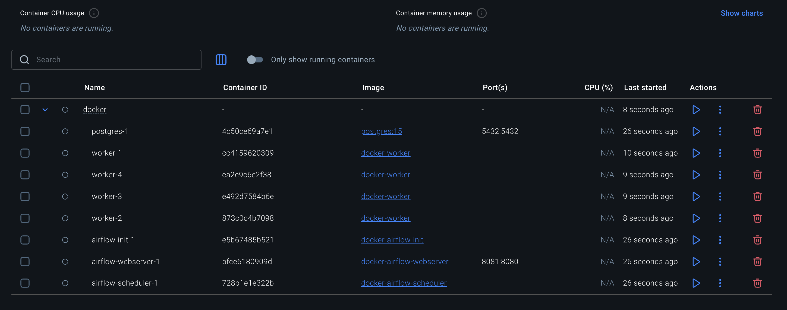
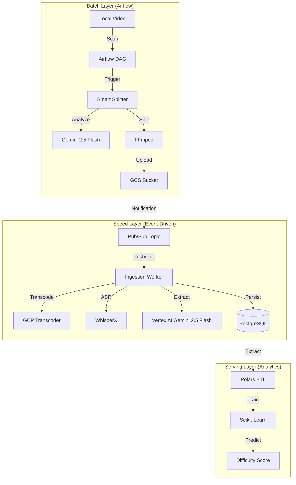
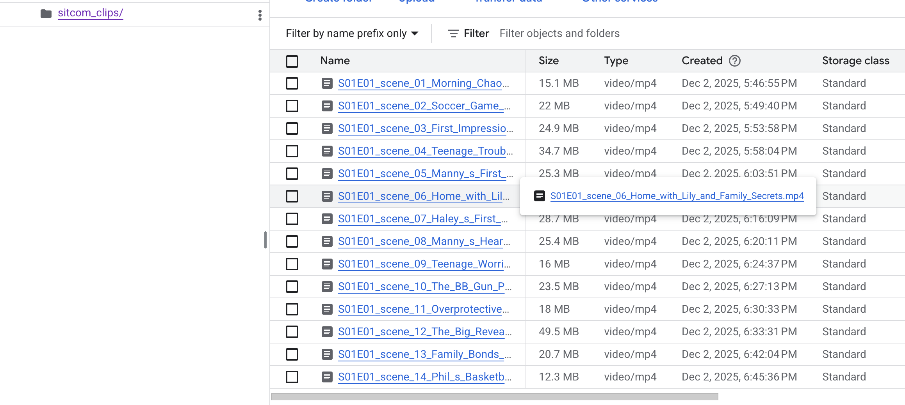
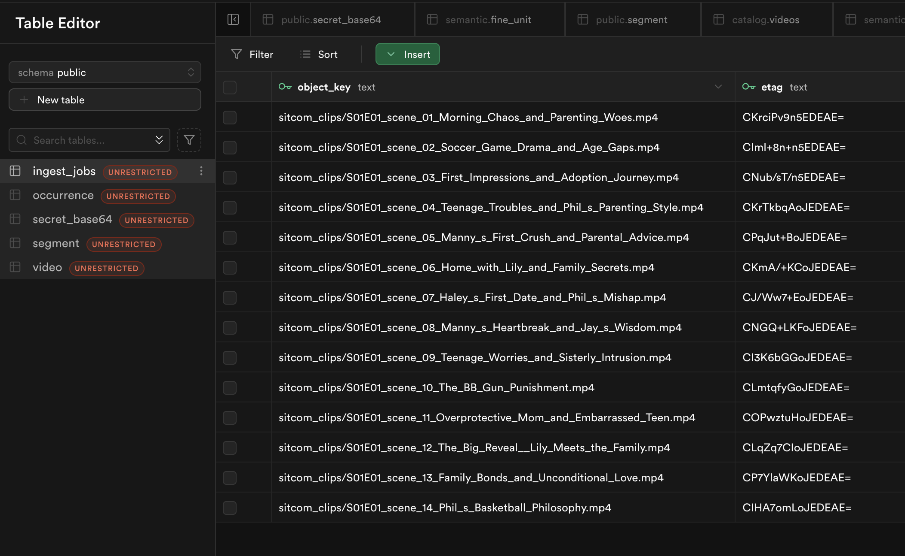
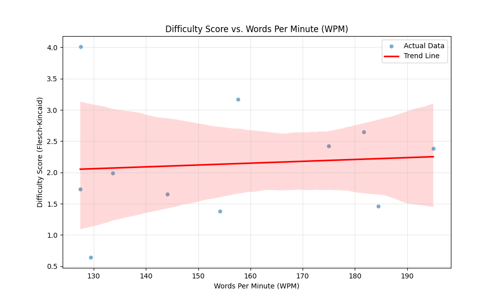

# Intelligent Video Analytics Platform (Clips Learning)

**Big Data Engineering Final Assignment - Fall 2025**

## 1. Project Overview & Purpose

Learning a new language through immersion is highly effective, but raw video content is unstructured and difficult to navigate for learners. A student looking for examples of "past tense" or "business vocabulary" has to manually scrub through hours of video.

**The Goal**: The purpose of this project is to build a robust, scalable data engineering pipeline that automatically transforms raw entertainment content into a structured educational dataset.

**The Solution**: We implemented an "Intelligent Video Analytics Platform". It uses Large Language Models (Gemini) to "watch" and segment full episodes into thematically coherent scenes. A parallelized worker pool orchestrated by Airflow then processes these scenes to extract linguistic features (vocabulary, phrases) and persists them into a relational database. Finally, an analytics engine assesses the difficulty of each clip to recommend appropriate content to learners.

## 1.1 Data Source

The primary dataset for this project is the **Season 1 of Modern Family**. 

*   **Video Source**: The raw video files (`.mkv`) were sourced from high-quality rips available on standard media repositories. 
*   **Video Storage**: The full episode is uploaded to a Google Cloud Storage (GCS) bucket and downloaded to the local machine for processing.
*   **Subtitle Source**: English `.srt` subtitles were downloaded from [OpenSubtitles](https://www.opensubtitles.org/) to assist the initial segmentation logic.
*   **Subtitle Storage**: The subtitles are stored in a Google Cloud Storage (GCS) bucket and downloaded to the local machine for processing.

## 2. System Architecture

The system is designed for **scalability** and **modularity**, utilizing a Lambda Architecture approach to handle both batch ingestion and real-time processing.

### A. Containerization & Orchestration

*   **Docker**: Every component (Airflow, Worker) runs in its own Docker container. This ensures the environment is reproducible and isolates dependencies. Note that while the compute is containerized, our **PostgreSQL** database is hosted on **Supabase** for managed scalability.
*   **Apache Airflow**: We use Airflow to manage the **Batch Layer**. It schedules the daily ingestion of new episodes. Airflow triggers the `Smart Splitter`, which acts as a "Map" step, breaking a large task (1 episode) into many small tasks (20+ scenes).



### B. Parallel Processing (The "Speed Layer")
We implemented an Event-Driven Architecture to handle the heavy lifting of video processing.



1.  **Pub/Sub Pattern**: When the Airflow DAG splits a video, it uploads individual clips to **Google Cloud Storage (GCS)**. This upload event triggers a notification to **Google Cloud Pub/Sub**. Both Pull and Push subscriptions are supported. The push architecture is implemented using FastAPI whie the pull architecture is implemented using the Google Cloud Pub/Sub client library as in the file worker_pull.py.
2.  **Scalable Workers**: Multiple instances of our **Ingestion Worker** subscribe to this topic so that the tasks can be processed in parallel.
3.  **Parallelism**: While the split of the entire episode to clips is implemented sequentially because ffmpeg is not the bottleneck, the upload of clips to GCS and the processing of clips, which are the bottlenecks, are implemented in parallel. If we upload 100 clips, 10 workers can process them simultaneously, significantly reducing the total time compared to a sequential script. 

### C. Data Ingestion & Storage
*   **Raw Data**: The system ingests `.mkv` video files and `.srt` subtitles.
*   **Processing Flow**:
    1.  **Smart Split**: Gemini 2.5 Flash analyzes the transcript to find semantic boundaries (e.g., "Scene changes from Kitchen to Living Room"). FFmpeg cuts the video on my local machine at these exact timestamps.
    2.  **Upload to GCS**: The clips are uploaded to GCS.
    
    3. ** Pubsub Notification**: The upload event triggers a notification to **Google Cloud Pub/Sub**, which is then processed by one of the Ingestion Workers deployed in the cluster orchestrated by Airflow.
    4.  **Transcoding**: The clips are transcoded to HLS format so that they can be played in the web app under different resolutions, Transcoder on Google Cloud is used for compatibility purposes.
    5.  **ASR Alignment**: We use **WhisperX** on Replicate AI to align the audio with the text, generating precise word-level timestamps and transcripts. Note that Tanscoding and ASR alignment are executed in parallel
    6.  **Knowledge Extraction**: A Gemini Agent in Vertex AI on Google Cloud analyzes the text to extract "Fine Units" (idioms, phrasal verbs, words) and generates "Evidence" (why this clip is a good context for learning the unit).
    7. **Persistence**: The extracted data is persisted into a PostgreSQL database.
    8. **Other Downstream Tasks**: The extracted data can be then used to build a recommendation system, which is outside the scope of this final course project.

### D. Operational SQL Queries
The pipeline relies on several key SQL operations to persist data:

**1. Job Tracking (Idempotency)**
To ensure we don't process the same video twice, we track the status of each ingestion job.
```sql
INSERT INTO ingest_jobs (object_key, etag, video_uid, video_id, status, started_at)
VALUES ($1, $2, $3, $4, 'PROCESSING', NOW())
ON CONFLICT (object_key) DO UPDATE SET status = 'PROCESSING';
```


**2. Persisting Segments**
After splitting and transcription, we save the time-aligned segments.
```sql
INSERT INTO segment (video_id, t_start, t_end, text, lang, meta)
VALUES ($1, $2, $3, $4, $5, $6)
RETURNING id;
```

**3. Persisting Knowledge (Occurrences)**
When the Agent identifies a learning unit, it links the segment to the fine unit.
```sql
INSERT INTO occurrence (segment_id, fine_id, evidence, status)
VALUES ($1, $2, $3, 'active');
```

**4. Context & Checks**
The pipeline also reads data to maintain context and avoid duplicates to support downstream tasks and data consistency.
*   **Check Video Existence**: `SELECT id FROM video WHERE video_uid = $1`
*   **Agent Context Lookup**: Before creating a new unit, the Agent checks if it exists.
    ```sql
    SELECT id, label, pos, def FROM semantic.fine_unit WHERE label = $1
    ```

*   **Storage (PostgreSQL)**:
    *   `video`: Metadata about the full episode.
    *   `segment`: Time-aligned text segments.
    *   `occurrence`: The core linguistic data—instances of vocabulary/grammar found in the video.
    *   `fine_unit`: The unit of knowledge pre existed in the database so that vertex AI can match each word or phrase it found from the segments to the fine unit through Gemini tool calling.

### E. Schema Design
The database schema follows a **Star Schema** variant optimized for linguistic analysis:

*   **`video` (Dimension)**: Stores metadata for the full episode (Title, Duration, GCS Path, etc).
*   **`segment` (Dimension)**: Represents a time-aligned subtitle block.
    *   *Relationship*: `video` (1) ↔ (N) `segment`.
*   **`fine_unit` (Dimension)**: A dictionary of knowledge units (e.g., the word "run", the phrase "take off").
    *   *Role*: Acts as the "Truth" table for what we want to teach.
*   **`occurrence` (Fact Table)**: The core transactional table linking a `segment` to a `fine_unit`.
    *   *Relationship*: `segment` (1) ↔ (N) `occurrence` ↔ (1) `fine_unit`.
    *   *Content*: Stores the "Evidence" (JSON) generated by the LLM explaining *why* this segment is a good for learning that unit.

### F. SQL Insights 
We have successfully ingested **Modern Family S01E01** and can derive the following insights using SQL:

**Query 1: Identifying "Hard" Clips (High Speech Rate)**
We calculated the Words Per Minute (WPM) for each clip to identify challenging content for advanced learners.
```sql
SELECT 
    v.id, 
    SUM(LENGTH(s.text)) / NULLIF(v.duration_seconds / 60.0, 0) as wpm
FROM video v
JOIN segment s ON v.id = s.video_id
GROUP BY v.id, v.duration_seconds
ORDER BY wpm DESC
LIMIT 5;
```
*   **Results**:
    * clip 5  958.68 WPM
    * clip 11 880.85 WPM
    * clip 8  844.49 WPM
    * clip 14 820.00 WPM
    * clip 3  787.42 WPM
*   **Insight**: The top clips have extremely high character-per-minute rates, indicating fast-paced dialogue or dense information, suitable for advanced learners.

**Query 2: Top Vocabulary (Joining with Knowledge Base)**
We can identify the most frequently occurring knowledge units in this episode by joining the `occurrence` table with the `fine_unit` table (in the `semantic` schema).
```sql
SELECT 
    f.label, 
    f.kind,
    COUNT(*) as frequency 
FROM occurrence o
JOIN semantic.fine_unit f ON o.fine_id = f.id
GROUP BY f.label, f.kind
ORDER BY frequency DESC
LIMIT 5;
```
*   **Results**:
    *   `know` (word_sense): 20 occurrences
    *   `get` (word_sense): 19 occurrences
    *   `be` (word_sense): 18 occurrences
*   **Insight**: The episode relies heavily on high-frequency verbs, reinforcing the "Communicative Approach" to language learning where common verbs are prioritized.
---


## 3. Analytics & Insights

We implemented an analytics engine to answer the question: *"How difficult is this clip for a learner?"*

### Methodology: ETL with Polars
We utilized **Polars**, a lightning-fast DataFrame library written in Rust, to handle the Extract-Transform-Load (ETL) process. Polars was chosen over Pandas for its superior performance and memory efficiency when handling large datasets.

**The Role of Polars in this Pipeline:**
1.  **Extract**: Efficiently reads raw segment data from PostgreSQL using the `connectorx` engine.
2.  **Transform (Aggregation)**: Groups thousands of individual subtitle segments by `video_id` to reconstruct the full text of each clip.
3.  **Feature Engineering**:
    *   **Words Per Minute (WPM)**: Calculated as `word_count / duration_minutes`.
    *   **Readability**: Integrates with `textstat` to compute the **Flesch-Kincaid Grade Level**.

This processed data (`analytics_data.csv`) serves as the training set for our machine learning model.

### Regression Analysis Results

We trained a **Linear Regression Model** (`scikit-learn`) to predict the Difficulty Score based on WPM and Word Count.

*   **Dataset**: Modern Family S01E01 (357 segments).
*   **Model Performance**:
    *   **MSE**: 0.4497
    *   **Coefficients**:
        *   `WPM`: +0.0011
        *   `Word Count`: -0.0079

### Interpretation and Insights
*   **WPM Correlation**: The positive coefficient for WPM (+0.0011) confirms our hypothesis: **faster speech correlates with higher difficulty scores**.
*   **Word Count**: The negative coefficient suggests that in this specific dataset, longer clips might use slightly simpler language.
*   **Conclusion**: The pipeline successfully transforms raw video into predictive insights. With more data, this model can be used to automatically tag "Easy", "Medium", and "Hard" clips for learners.

---

## 4. Undercurrents of Data Engineering

This project demonstrates key data engineering principles:

*   **Scalability**: The ingestion worker is designed to be stateless. We can scale from 1 to 100 workers simply by adding more containers/pods to handle high load.
    *   *Example*: The `worker_pull.py` script pulls messages from Pub/Sub. If the queue depth increases, we can spin up more instances of this container. Each worker processes one clip independently, with no shared state other than the database.

*   **Modularity**: The codebase is organized into `domain`, `application`, and `infrastructure` layers (Hexagonal Architecture).
    *   *Example*: The `VertexClient` (`src/ingestion_worker/infrastructure/vertex.py`) implements a generic interface. If we wanted to switch from Gemini to GPT-4, we would only need to create a `OpenAIClient` that implements the same interface, without changing the core business logic in `workflow.py`.

*   **Reusability**: We use a shared `SmartSplitter` logic that can be run as a script or imported as a module.
    *   *Example*: The `smart_split.py` script reuses the `SceneManager` class. This same class could be used in a real-time stream processor or a different batch job.

*   **Reliability**: We implemented **Idempotency** checks to prevent duplicate processing.
    *   *Example*: Before processing a clip, the worker checks the `ingest_jobs` table. If a job with the same `object_key` and `etag` exists and is `DONE`, it skips processing. This ensures that if Pub/Sub delivers a message twice (at-least-once delivery), we don't corrupt our data.

*   **Observability**: Structured JSON logging allows us to trace a video from Ingestion -> Split -> Pub/Sub -> Worker -> DB.
    *   *Example*: Every log message includes the `video_uid` and `message_id`. We can grep the logs for a specific ID to see the entire lifecycle of a clip across distributed components.

---

## 5. Testing Strategy

We adopted a **modular, bottom-up testing strategy** to ensure the reliability of each component before integrating them into the full pipeline. All tests are located in the `scripts/` folder and follow this hierarchy:

### Level 1: Infrastructure Tests (The Foundation)
We verify that our external adapters (Infrastructure Layer) are working correctly in isolation.
*   `test_database.py`: Verifies connection to Supabase/PostgreSQL and CRUD operations.
*   `test_gcs.py`: Tests uploading, downloading, and signing URLs with Google Cloud Storage.
*   `test_transcoder.py`: Validates the integration with GCP Transcoder API.
*   `test_replicate.py`: Checks the connection to Replicate for WhisperX ASR.

### Level 2: Component Tests (The Core)
Once the infrastructure is verified, we test the core logic.
*   `test_agentic_system.py`: Tests the `GeminiAgent` and its ability to extract knowledge from text using the defined tools.
*   `test_persistence.py`: Verifies that the extracted domain objects can be correctly mapped and saved to the database.

---

## 6. Setup & Usage

### Prerequisites
*   Docker & Docker Compose
*   Supabase
*   GCP Account (Vertex AI, GCS, Pub/Sub enabled)
*   Replicate API Token for WhisperX
*   Python 3.10+
*   **Environment Variables**: Create a `.env` file in the root directory. You will need Supabase credentials, GCP project details, and Replicate API tokens.

### Quick Start
1.  **Install Dependencies**:
    ```bash
    pip install -r requirements.txt
    ```
2.  **Start Infrastructure and workers in docker**:
    ```bash
    docker-compose -f docker/docker-compose.yml up -d
    ```
3.  **Trigger Ingestion**:
    ```bash
    python scripts/smart_split.py resources/modern_family/S01/S01E01.mkv --transcript resources/modern_family/S01/S01E01.srt --upload
    ```
4.  **Run Analytics**:
    ```bash
    python src/analytics/analytics/etl.py
    python src/analytics/model.py
    ```
5.  **Get SQL Insights**:
    ```bash
    python scripts/run_queries.py
    ```

### Troubleshooting
*   **Missing Credentials**: Double-check `.env` file and ensure `sa-key.json` is present for Google Cloud authentication.
*   **Import Errors**: If Python cannot find the modules, try running `pip install -e .` again to install the package in editable mode.

---

## 7. Development & CI/CD

We have set up a reproducible development environment and Continuous Integration (CI) pipeline.

### Convenience Commands (Makefile)
We use a `Makefile` to simplify common tasks:
*   `make install`: Install dependencies.
*   `make test`: Run a default test. Note that the test we mentioned previously will incur API token cost from both replicate and Google Cloud. Therefore, we don't want them to be triggered everytime we push to main branch. So we skip them here and put them in scripts/test_*.py to be run locally.
*   `make up`: Start the Docker infrastructure.
*   `make lint`: Check code quality.

### Continuous Integration
A GitHub Actions workflow (`.github/workflows/ci.yml`) is configured to:
1.  Trigger on every `push` to `main`.
2.  Set up a clean Python environment.
3.  Install dependencies.
4.  Run the default test (`pytest`).

## 8. Team Contributions

This project was a collaborative effort by the team over the course of 3 weeks.

*   **Xinping Xue (Backend Engineer)**:
    *   Implemented the core **Ingestion Worker** and Event-Driven (Pub/Sub) system.
    *   Designed the persistence layer and idempotency mechanisms.
    *   Set up docker orchestration and CI/CD pipelines.

*   **Patrick Zhu (Backend Engineer)**:
    *   Implement various components in infrastructure and domain layer.
    *   Developed part of the agentic logic with Gemini 2.5 Flash.
    *   Implemented Vertex integration and Transcoder API connections.

*   **Yuqian Wang (Data Scientist)**:
    *   Developed the **Analytics Engine** using Polars for high-performance ETL.
    *   Trained the Machine Learning model (Scikit-Learn) for difficulty prediction.
    *   Conducted SQL analysis and generated data insights.

